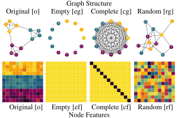

perturbations.py
===================================

Visualized below, there are three main types of perturbations - `empty`, `complete`, and `random` - that can be applied to either the node features or graph structure.

|

|

.. automodule:: rings.perturbations
   :members: